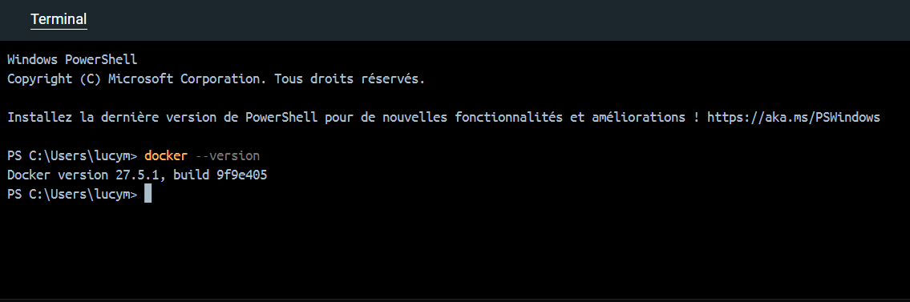
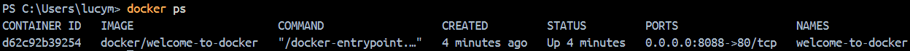
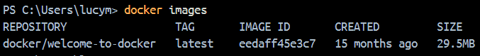
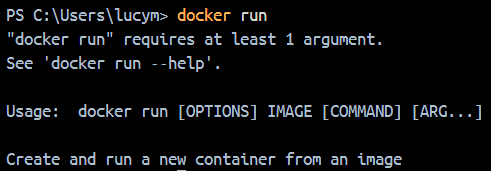
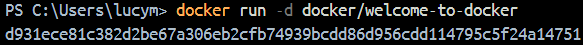
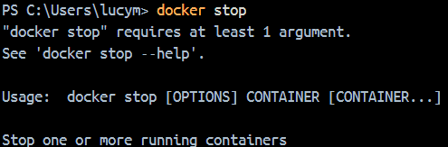
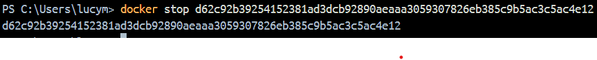

<!-- Titre -->
# 🐋Exercices Docker

<!-- Introduction -->
## 📋Description du projet
Ce projet a pour objectif l'apprentissage des commandes de base de Docker à travers l'utilisation de l'image _Welcome to Docker_. Après avoir installé Docker et créé mon compte, j'ai déployé cette image pour tester différentes commandes en suivant mon énoncé. Certaines commandes contenaient des erreurs qu'il a fallu repérer et corriger en identifiant les éléments manquants pour les exécuter correctement.

<!-- Exercices -->
### 🔄️Vérification de la version de Docker avec ```docker --version```



### Test des commandes de base dans le terminal :
* ````docker info```


* ````docker ps```



* ````docker images```



* ````docker run``` qui est une <span class="text-danger">erreur</span> ❌



 * ````docker run -d <nomimage>``` qui est la bonne commande pour créer un conteneur avec l’image dedans ✔️
 
 

* ````docker run``` qui est une <span class="text-danger">erreur</span> ❌



 * ````docker stop <idconteneur>``` qui est la bonne commande pour arrêter le docker ✔️
 
 