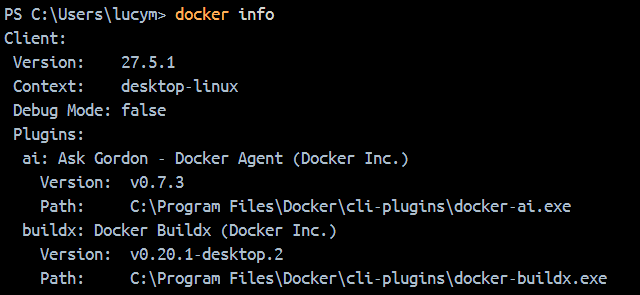
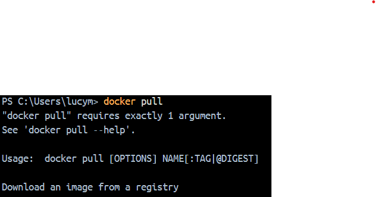
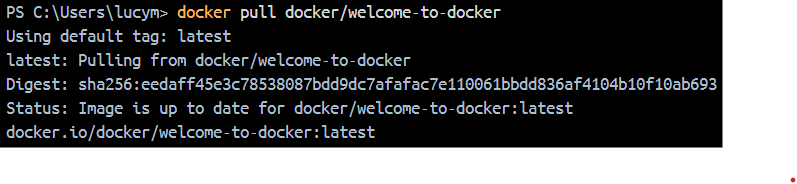
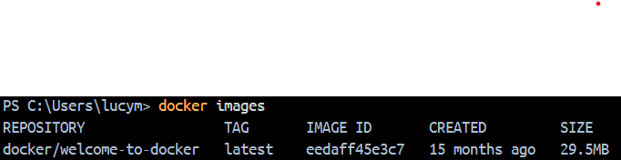
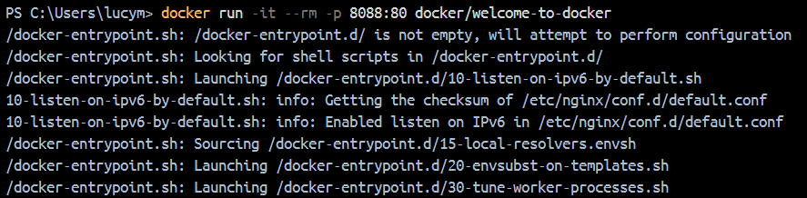
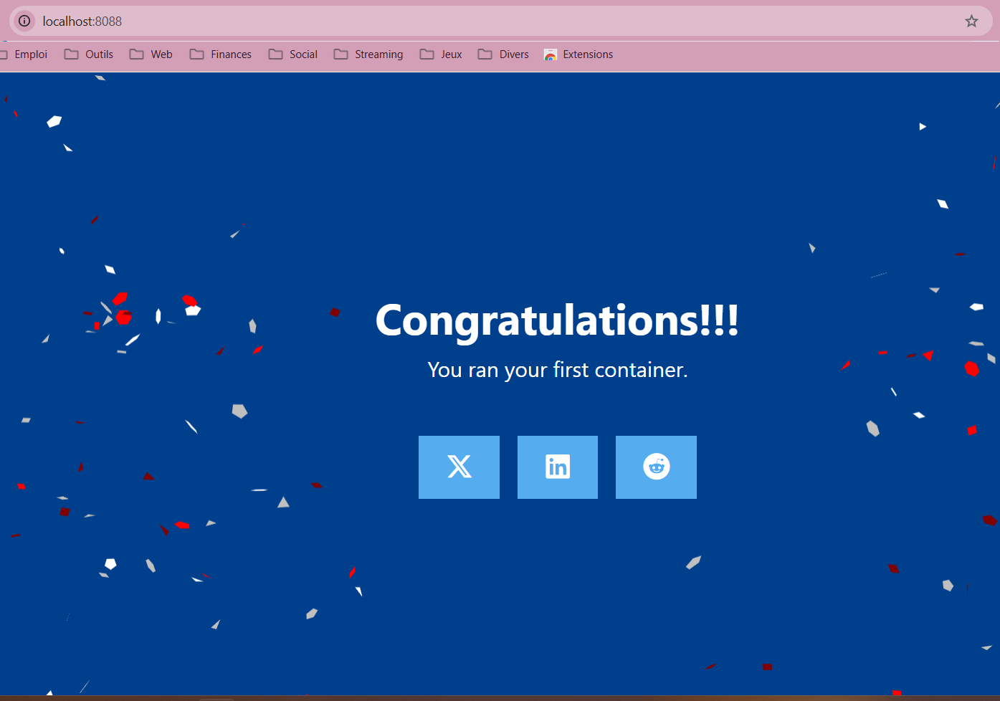

<!-- Titre -->
# 🐋Exercices Docker

<!-- Introduction -->
## 📋Description du projet
Ce projet a pour objectif l'apprentissage des commandes de base de Docker à travers l'utilisation de l'image _Welcome to Docker_. Après avoir installé Docker et créé mon compte, j'ai déployé cette image pour tester différentes commandes en suivant mon énoncé. Certaines commandes contenaient des erreurs qu'il a fallu repérer et corriger en identifiant les éléments manquants pour les exécuter correctement.

<!-- Exercices -->
## 🔄️ Vérification de la version de Docker avec  
```docker --version``` 


### ⌨️ Test des commandes de base dans le terminal :
* ```docker info```: Affiche toutes les infos du cluster.



* ```docker ps```: Affiche les conteneurs actifs.


* ```docker images```: Affiche toutes les images avec leurs propriétés.


* ```docker run``` ❌ Cette commande seule est incorrecte, car il manque le nom de l'image à exécuter.


* ```docker run -d <nomimage>``` ✔️ Cette commande permet de créer et d'exécuter un conteneur à partir d'une image.


* ```docker stop``` ❌ Cette commande seule est incorrecte, car il manque l'ID ou le nom du conteneur à arrêter.


* ```docker stop <idconteneur>``` ✔️ Cette commande permet d'arrêter un conteneur en précisant son ID ou son nom.


### 📥 Récupération de l'image Docker

* ```docker pull``` ❌ Cette commande seule est incorrecte, car il manque le nom de l'image à récupérer.



* ```docker pull <nomimage>``` ✔️ Cette commande permet de télécharger une image depuis Docker Hub.



* ```docker images```



### 🏗️ Construction du container Docker

* ```docker run -it --rm -p xxxx:80 “nom de l’image”```



* Pour que la commande fonctionne, il faut remplacer ```xxxx``` par un moyen d'accéder au container. En mettant ```8088```, on arrive sur la page _Welcome to Docker_ grâce au lien : ```localhost:8088```.

