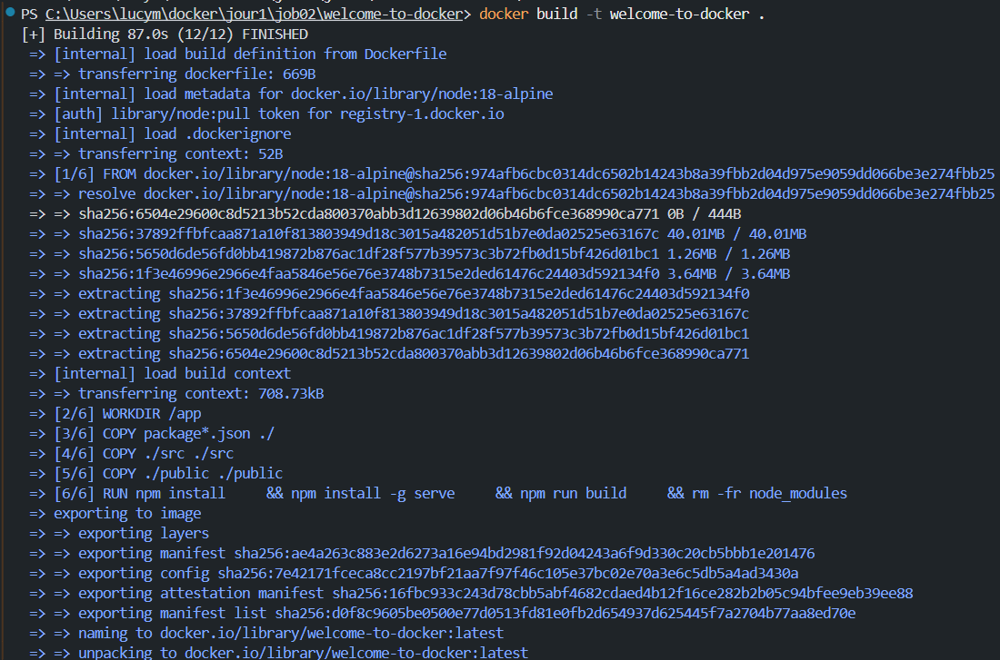
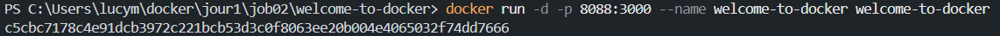
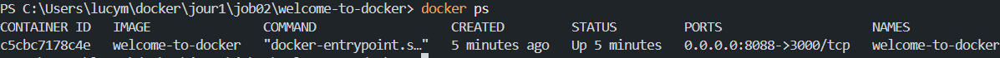
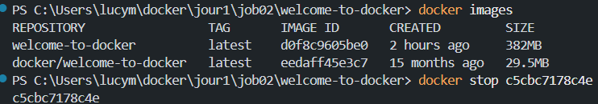
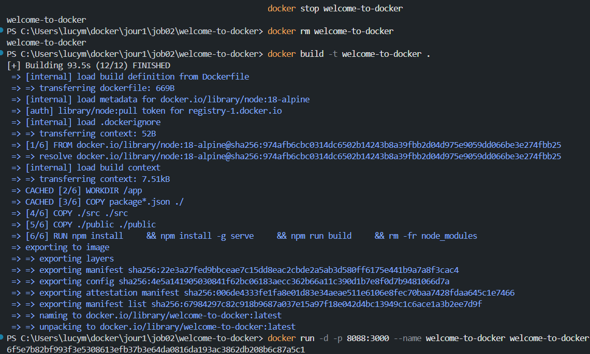
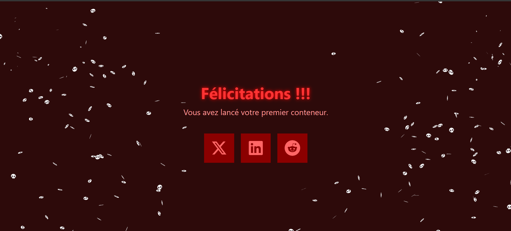
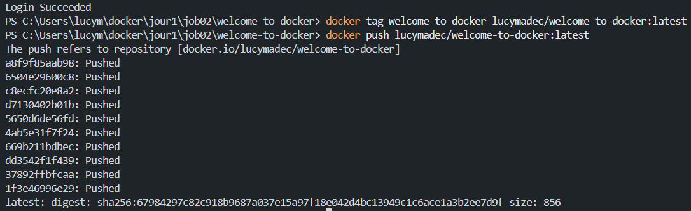
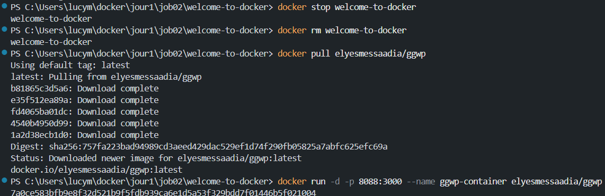
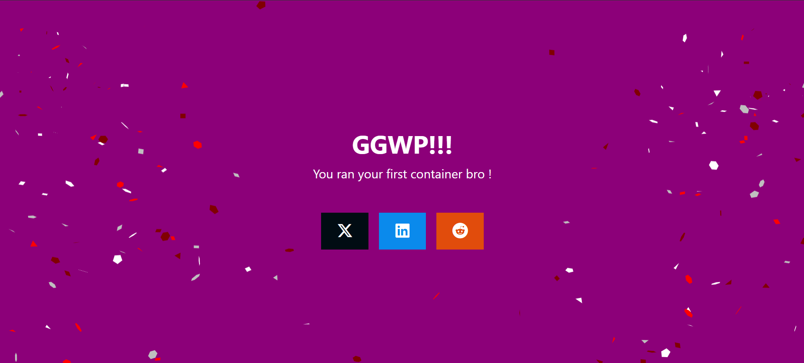
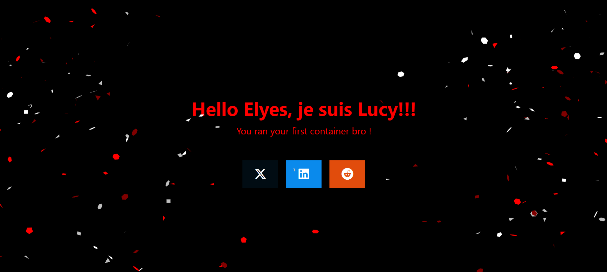

# 🐋 Projet Docker - Clonage et Conteneurisation

## 📋 Description du projet
Dans cet exercice, il fallait cloner le projet welcome-to-docker depuis GitHub, l'ouvrir dans Visual Studio Code, puis le déployer dans un conteneur Docker. Le projet sera modifié et redéployé pour comprendre le cycle complet de développement avec Docker.

## 📝 Exercices

### 1. Création de l'image Docker
La première étape consiste à créer une image Docker à partir de notre projet cloné.

### 2. Lancement du conteneur
Après la création de l'image, nous lançons notre conteneur pour exécuter l'application.

### 3. Vérification du lancement
Vérification que notre conteneur est bien en cours d'exécution.

### 4. Test des commandes basiques
Exécution des commandes Docker de base pour gérer notre conteneur.

### 5. Visualisation du résultat
Aperçu de notre application en cours d'exécution.

### 6. Modifications du code
Modifications apportées au code source de l'application.

### 7. Nouveau résultat
Visualisation des changements après les modifications.

### 8. Publication de l'image
Publication de notre image modifiée sur Docker Hub.

### 9. Récupération de la nouvelle image
Téléchargement de l'image depuis Docker Hub.

### 10. Résultat du membre
Visualisation du résultat pour un membre de l'équipe.

### 11. Récupération de l'image membre
Récupération de l'image d'un autre membre de l'équipe.

### 12. Résultat modifié membre
Visualisation du résultat après modification par un membre.

