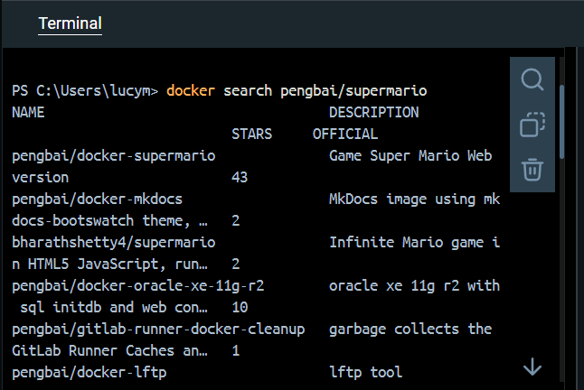
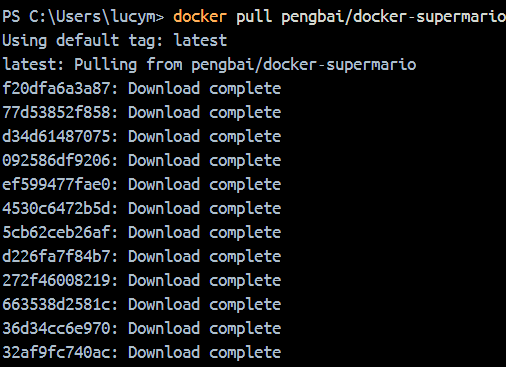
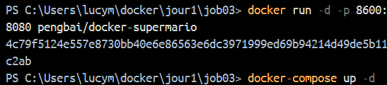
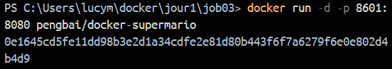
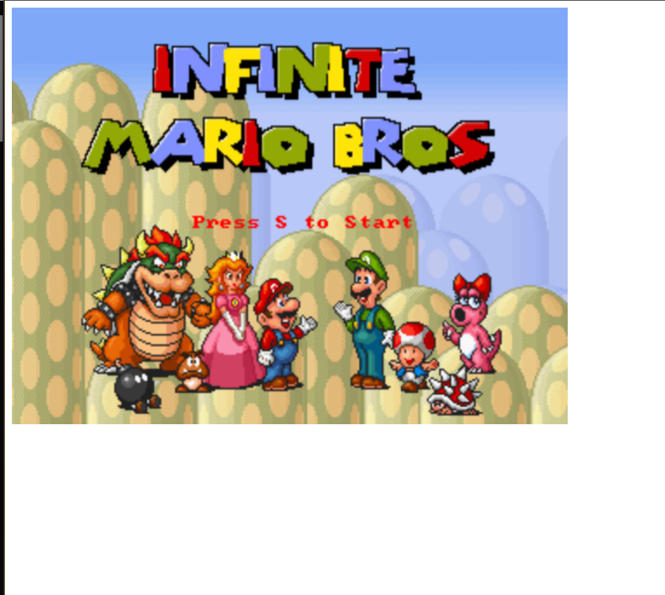
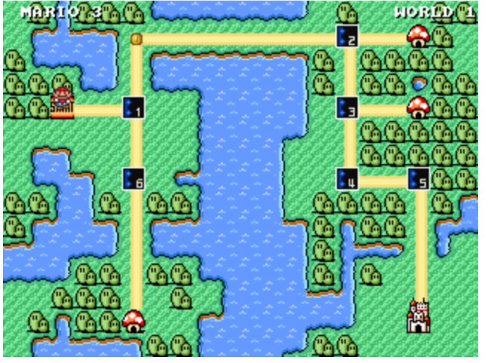
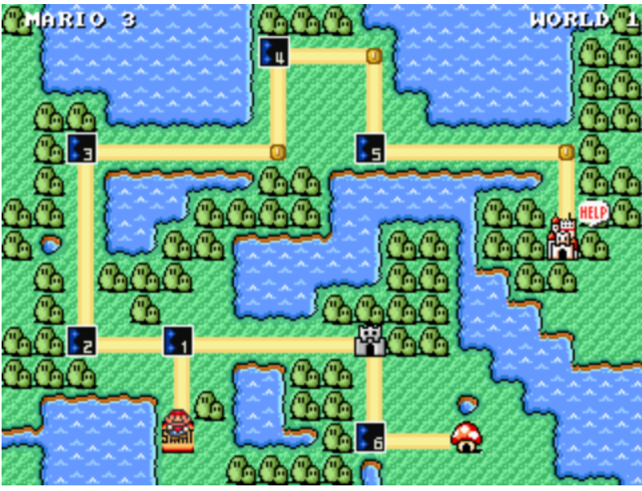
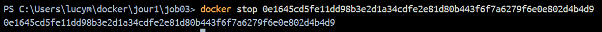
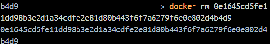
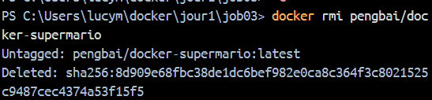

# 🐋 Docker Super Mario - Déploiement et Gestion

## 📋 Description du projet
Ce projet consiste à déployer et gérer le jeu Super Mario en utilisant Docker. Exploration de différentes méthodes de déploiement, de gestion des conteneurs et des images Docker, en utilisant à la fois la ligne de commande et Docker Compose.

## 🎮 Déploiement du jeu

### 1. Recherche de l'image
```bash
docker search pengbai/supermario
```
Cette commande nous permet de trouver l'image correcte : `pengbai/docker-supermario`



### 2. Récupération de l'image
```bash
docker pull pengbai/docker-supermario
```




### 3. Méthodes de lancement

#### Méthode 1 : Via Docker CLI
```bash
docker run -d -p 8600:8080 pengbai/docker-supermario
```

#### Méthode 2 : Via Docker Compose
```yaml
version: '3'
services:
  supermario:
    image: pengbai/docker-supermario
    ports:
      - "8600:8080"
    container_name: supermario
```












## 🔄 Gestion des conteneurs

### Trouver l'ID d'un conteneur
Deux méthodes possibles :
1. ```docker ps```
2. ```docker container ls```

### Arrêter un conteneur
```bash
docker stop <ID_ou_nom_du_container>
```



### Supprimer un conteneur
Deux méthodes possibles :
1. ```docker rm [-f] <ID_ou_nom_du_container>```
2. ```docker container rm [-f] <ID_ou_nom_du_container>```

Note : L'option `-f` force la suppression d'un conteneur en cours d'exécution.



## 🗑️ Gestion des images

### Supprimer une image
Deux méthodes possibles :
1. ```docker rmi pengbai/docker-supermario```
2. ```docker image rm pengbai/docker-supermario```


