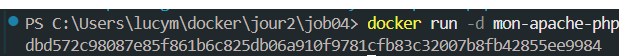
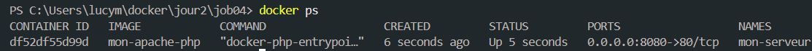
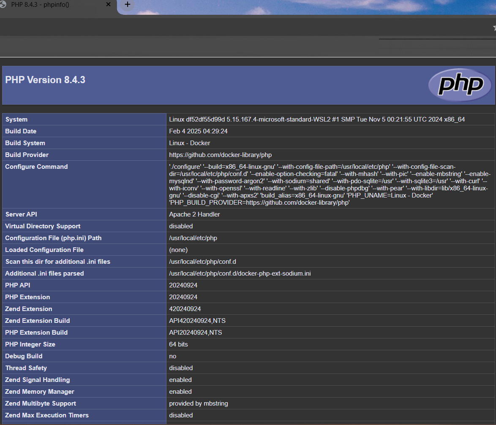
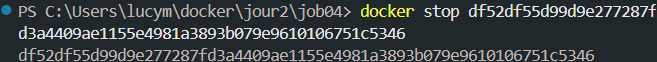

# 🐋 Docker Apache/PHP

## 📋 Description du projet
Dans cet exercice, nous allons créer une image Docker contenant un serveur Apache configuré pour exécuter des scripts PHP. L'objectif est de mettre en place un environnement web simple permettant d'exécuter des commandes PHP dans un conteneur isolé.

## 📝 Exercices

### 1. Création de l'image Docker
Création de l'image Docker avec Apache et PHP installés.

### 2. Création du conteneur
Configuration et création du conteneur à partir de notre image.

### 3. Lancement du conteneur
Démarrage du conteneur et vérification de son état.

### 4. Visualisation du résultat
Affichage de la page PHP exécutée par notre serveur Apache.

### 5. Arrêt du conteneur
Arrêt propre du conteneur après utilisation.

