# Job 05 - Jeu de Morpion avec Docker 🎮

## 📝 Description
Ce projet consiste à héberger un jeu de Morpion (Tic Tac Toe) sur le web en utilisant Docker. L'application utilise Nginx comme serveur web et PHP pour la gestion des résultats.

## 📂 Structure du Projet
- `index.html`: Interface principale du jeu
- `save.php`: Gestion de la sauvegarde des résultats
- `results.json`: Stockage des résultats des parties
- `Dockerfile`: Instructions pour la construction de l'image Docker
- `nginx.conf`: Configuration du serveur Nginx

## 🐳 Configuration Docker
- Image de base : Nginx Alpine
- Port exposé : 80 (mappé sur 8080)
- Volume nommé : "game-results" pour le stockage persistant
- PHP-FPM configuré pour le traitement des fichiers PHP

## 🚀 Installation et Exécution

### 🛠️ Construction de l'Image Docker
```bash
docker build -t tictactoe-nginx .
```

### 💾 Création et Vérification du Volume
```bash
docker volume create game-results
docker volume ls
```

### ▶️ Lancement du Conteneur
```bash
docker run -d -p 8080:80 -v game-results:/usr/share/nginx/html/game-data tictactoe-nginx
```

### 📊 Accès aux Résultats
Vous pouvez voir les résultats de plusieurs façons :
1. Via Docker Desktop :
   - Aller dans Volumes > game-results
   - Consulter le contenu de results.json

2. Via le Terminal :
```bash
docker exec <container_id> cat /usr/share/nginx/html/game-data/results.json
```

## 🎯 Étapes de Réalisation

### 1. Construction de l'Image Docker 🛠️
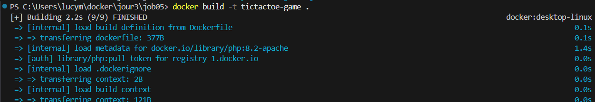

### 2. Vérification des Images 📋
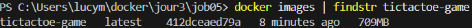

### 3. Lancement du Conteneur ▶️
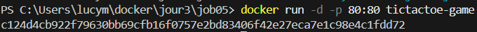

### 4. Création du Volume 💾
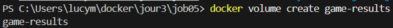

### 5. Lancement avec Volume 🔄
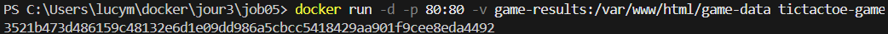

### 6. Vérification du Port 8080 🌐
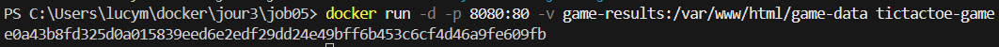

### 7. Inspection du Volume 🔍
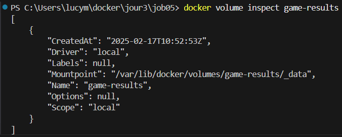

### 8. Vérification des Résultats 📊
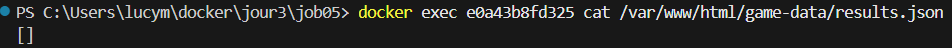

### 9. Construction de l'Image Nginx 🏗️
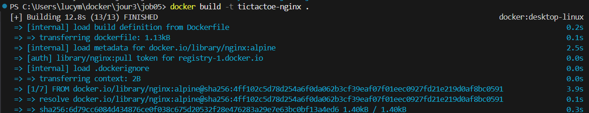

### 10. Lancement de Nginx ▶️
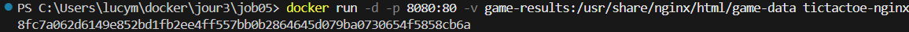

### 11. Copie des Fichiers 📁
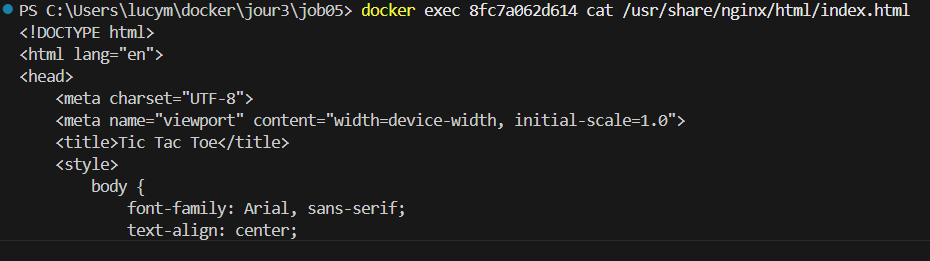

### 12. Configuration du Port 80 🔌
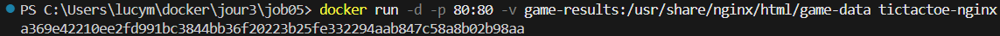

### 13. Mappage du Port 8080 🔄


### 14. Vérification du Volume 💾
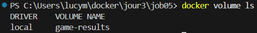

### 15. Fichiers dans le Volume 📂
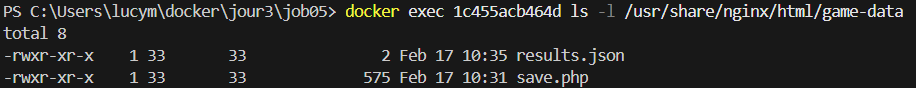

### 16. Persistance du Volume 💽
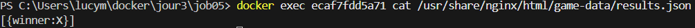

### 17. Contenu du Conteneur 📦
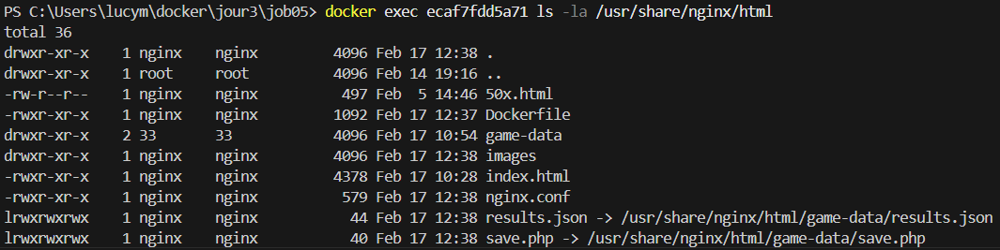

### 18. Inspection du Volume 🔍
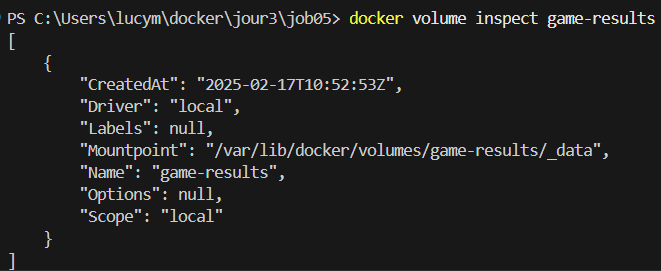

### 19. Contenu du Volume 📂
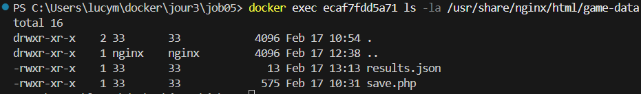

### 20. Commandes Terminal 💻
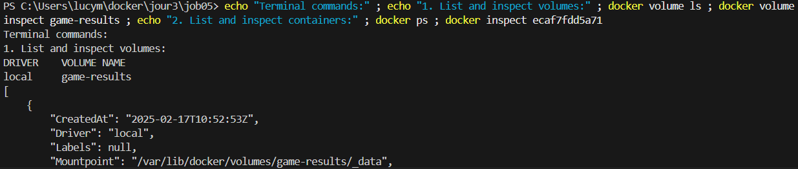

### 21. Volume dans Docker Desktop 🖥️
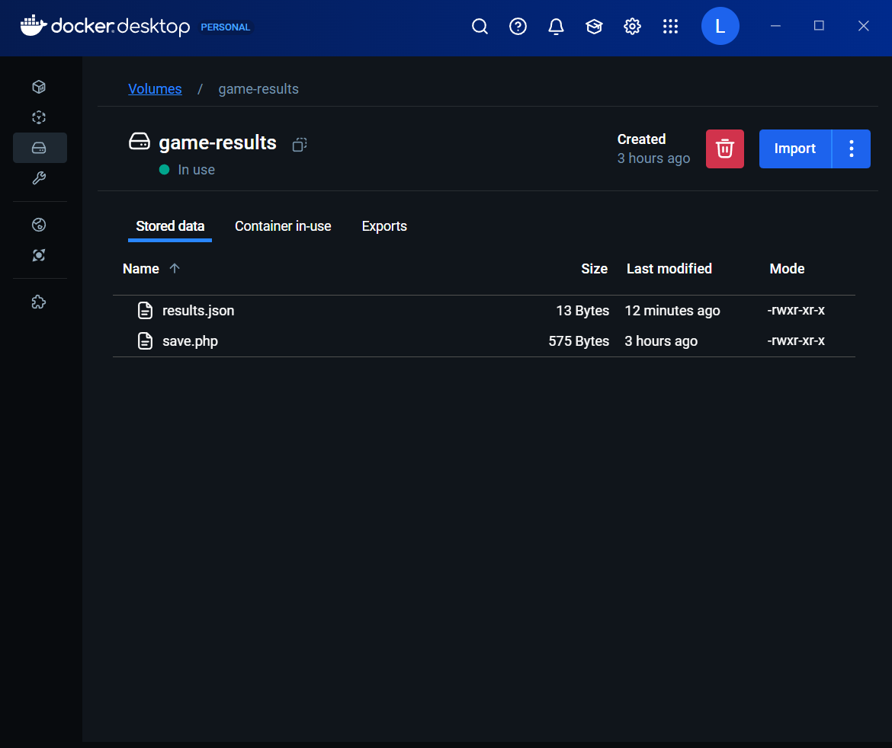

### 22. Conteneur dans Docker Desktop 🐳
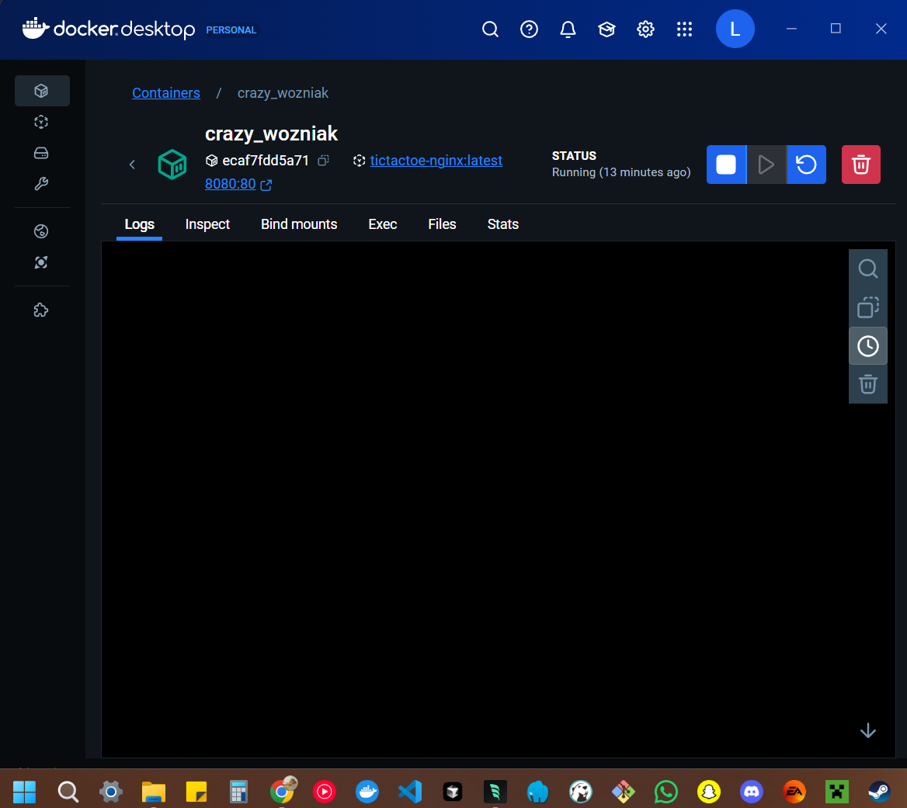

### 23. Résultats dans le Terminal 📊
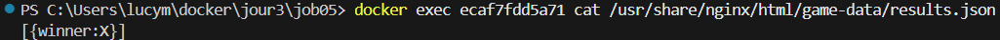

### 24. Résultats dans Docker Desktop 🖥️
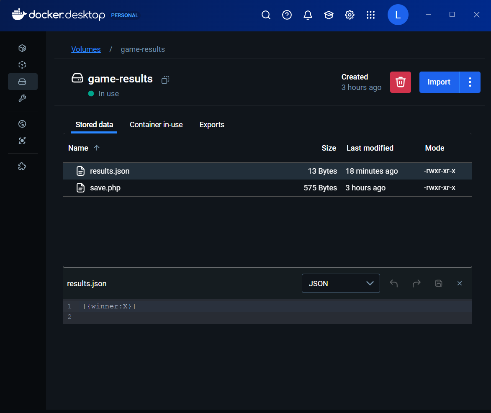

### 25. Résultats des Parties 🎮
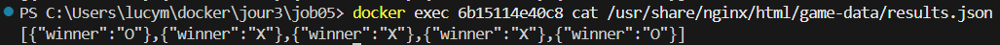

### 26. Arrêt du Conteneur ⏹️
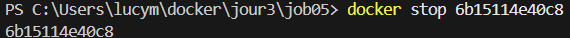

### 27. Suppression du Conteneur 🗑️
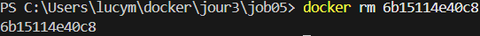

### 28. Résultats Finaux 🏆
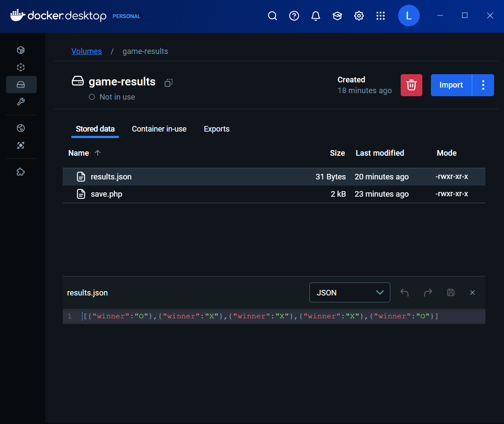
