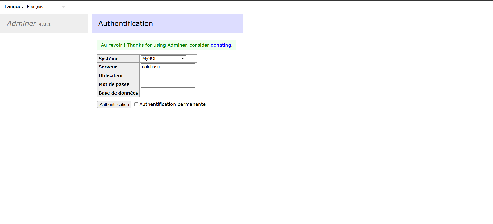
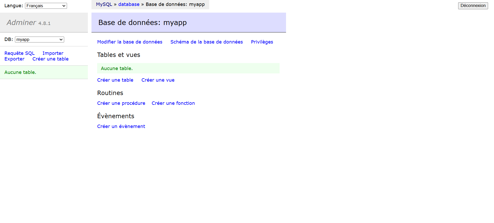
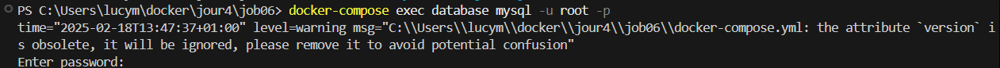
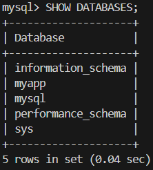
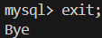

# Application Multi-conteneurs avec Docker Compose 🐳

## Description du Projet
Ce projet met en place une application web complète utilisant une architecture multi-conteneurs avec Docker Compose. L'application est composée de quatre services principaux :

- 🗄️ **Base de données MySQL**
- ⚙️ **Backend Node.js**
- 🖥️ **Frontend Nginx**
- 🛠️ **Adminer pour l'administration de la BDD**

## Structure du Projet
```
job06/
├── frontend/         # Configuration et code du frontend
├── backend/          # Configuration et code du backend
├── images/          # Captures d'écran du projet
└── docker-compose.yml
```

## Configuration des Services

### Base de données (MySQL)
- Port: 3306
- Données persistantes via volume Docker
- Credentials sécurisés configurés via variables d'environnement

### Backend (Node.js)
- Image: node:16-alpine
- Port: 3000
- Dépendances: express, mysql2

### Frontend (Nginx)
- Image: nginx:alpine
- Port: 8080
- Sert l'interface utilisateur

### Adminer
- Port: 8081
- Interface web pour la gestion de la base de données

## Test de Connectivité 🔌

### 1. Interface de Connexion Adminer

*Page de connexion à l'interface d'administration de la base de données*

### 2. Connexion Réussie à Adminer

*Vue de la base de données après connexion réussie*

### 3. Logs de Connexion Backend

*Logs montrant la connexion réussie du backend à la base de données*

## Démonstration Complète 🚀

### 1. Accès au Backend (localhost:3000)
- Route `/` : Message de bienvenue de l'API
- Route `/api/status` : Vérification du statut de la base de données avec timestamp

### 2. Accès à MySQL via Terminal

*Connexion au shell MySQL via le terminal*


*Liste des bases de données disponibles*


*Commande pour quitter le shell MySQL*

### 3. Accès Direct à MySQL (Port 3306)
> ⚠️ Note : L'accès direct via `http://localhost:3306` n'est pas possible car MySQL n'utilise pas HTTP. L'accès doit se faire via :
> - Un client MySQL
> - Le terminal (comme démontré ci-dessus)
> - Adminer (interface web)

### 4. Commandes Utiles
```bash
# Connexion au shell MySQL
docker-compose exec database mysql -u root -p

# Dans le shell MySQL
SHOW DATABASES;  # Afficher les bases de données
exit;           # Quitter le shell
```

## Réseau
Tous les services sont connectés via un réseau Docker bridge personnalisé pour assurer une communication sécurisée entre les conteneurs.

## Étapes de Progression

### 1. Configuration Initiale ✅
- Création de la structure du projet
- Configuration du docker-compose.yml
- Mise en place des réseaux et volumes

### 2. Test de Connectivité ✅
- Connexion réussie entre le backend et la base de données
- Accès à l'interface Adminer fonctionnel
- Communication établie entre tous les services

### 3. Démonstration Complète ✅
- Tests des endpoints backend
- Accès à la base de données via différentes méthodes
- Vérification de la connectivité globale
